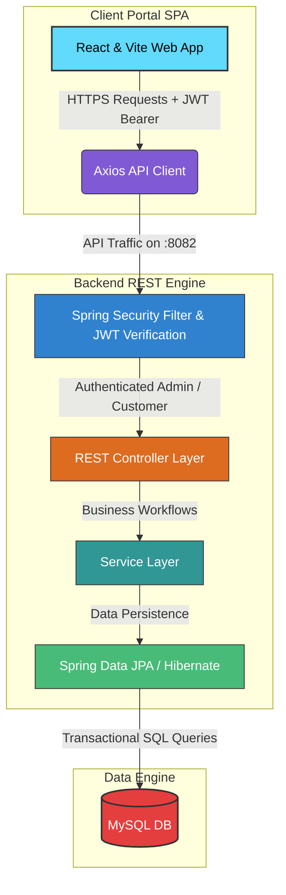

# 💊 RxFlow — Enterprise Pharmacy Management System

[](https://spring.io/projects/spring-boot)
[](https://react.dev/)
[](https://tailwindcss.com/)
[](https://www.mysql.com/)

An enterprise-grade, full-stack pharmacy management ecosystem engineered with **Spring Boot**, **React (Vite)**, and **MySQL**. Developed as a **Second Year, First Semester Project**, RxFlow empowers modern pharmacies with robust Role-Based Access Control (RBAC), intelligent medicine batch-expiry tracking, simplified automated sales and inventory reporting, and a high-performance business-focused administrative control center.

---

## 📐 System Architecture

Below is the design overview of the RxFlow architecture, demonstrating the seamless flow between the Client Single Page Application (SPA), the secure Spring Boot Gateway, the Service/Data persistence layers, and the MySQL Database.



---

## ✨ Core Feature Highlights

### 💼 Professional Business Admin Portal
* **Streamlined UI:** A clean, professional, high-density dashboard tailored for fast-paced operational workflows, replacing distracting patterns with streamlined, high-contrast layouts.
* **Consolidated Tabbed Workspace:** Effortlessly toggle between Users, Medicines, Orders, Deliveries, Expirations, and Reports within a single SPA viewport.
* **Urgent Alarm Center:** High-visibility contextual banners notifying administrators of low stock thresholds or critical medicine expiration dates.

### 📅 Advanced Batch & Expiry Analytics
* **Granular Batch Tracking:** Manage medicine quantities, purchase values, and manufacture/expiry dates linked to individual vendor batches.
* **Financial Risk Assessment:** Displays the total value-at-risk for expired or near-expiry batches to optimize inventory write-offs.
* **Dynamic Time-to-Expiry Tracking:** Automated server-side updates classifying batches into `ACTIVE`, `EXPIRING_SOON` (30 Days), `NEAR_EXPIRY` (7 Days), `EXPIRED`, `DISPOSED`, and `RECALLED` statuses.
* **Bulk Disposal Actions:** Seamlessly dispose of multiple expired batches in a single operation.

### 📊 One-Month Sales & Low Stock Reporting
* **Optimized Reporting Pipelines:** One-click generation of the last 30 days' sales performance summaries.
* **Inventory Control Reporting:** Instant aggregation of low-stock medicines, facilitating timely restocks and preventing stockouts.

### 🔐 Secure RBAC & Authentication
* **JWT Guarded Sessions:** Stateless authorization with short-lived tokens and secure client-side storage policies.
* **Granular Endpoint Protection:** Spring Security rules utilizing `@PreAuthorize("hasRole('ADMIN')")` declarations to defend sensitive administrative resources.
* **Robust Password Encryption:** Industry-standard **BCrypt** hashing functions securing authentication credentials.

---

## 🛠️ Technology Stack & Dependencies

### Frontend
- **Framework:** React 18 (Vite SPA template)
- **Styling:** Tailwind CSS + PostCSS
- **Routing:** React Router DOM (v6)
- **HTTP Client:** Axios (configured with interceptors)
- **Icons:** Lucide React
- **Notifications:** React Toastify

### Backend
- **Framework:** Spring Boot 3.x
- **Security:** Spring Security & JWT (JSON Web Tokens)
- **Persistence:** Spring Data JPA (Hibernate Dialect)
- **Database:** MySQL 8.x
- **Documentation:** Swagger UI / OpenAPI 3
- **Build System:** Maven

---

## 🚀 Quick Start Guide (Local Setup)

Follow these steps to run RxFlow in your local development environment.

### Prerequisites
* Java Development Kit (JDK) 17 or higher
* Node.js (v18.x or higher) and npm
* MySQL Server 8.0+ or Docker Desktop

---

### Step 1: Spin Up the Database

You can run MySQL locally using Docker or via your native database server.

#### Option A: Docker Compose (Recommended)
From the project root directory, navigate to the docker folder and spin up the database container:
```bash
cd docker
docker-compose up -d
```
*This configures a MySQL 8.0 server on port `3306` with the database `pharmacy` and the root password `root`.*

#### Option B: Manual Installation
1. Connect to your MySQL server using your preferred client.
2. Execute the following to create the database:
   ```sql
   CREATE DATABASE pharmacy_1db;
   ```
3. Update database credentials in the backend configurations.

---

### Step 2: Configure & Start the Backend

1. Navigate to the `backend` directory:
   ```bash
   cd backend
   ```
2. Open `src/main/resources/application.properties` and verify/update your MySQL credentials:
   ```properties
   spring.datasource.url=jdbc:mysql://localhost:3306/pharmacy_1db?createDatabaseIfNotExist=true
   spring.datasource.username=root
   spring.datasource.password=password123
   ```
3. Run the Spring Boot application:
   ```bash
   mvn spring-boot:run
   ```
4. Access the API & Documentation:
   * **Base REST Endpoint:** `http://localhost:8082`
   * **Swagger OpenAPI Docs:** [http://localhost:8082/swagger-ui/index.html](http://localhost:8082/swagger-ui/index.html)

> [!NOTE]
> Database tables will be automatically initialized by JPA. You can manually run the `/backend/src/main/resources/sample-data.sql` file if you wish to populate the system with robust mock datasets.

---

### Step 3: Run the Frontend App

1. Navigate to the `frontend` directory:
   ```bash
   cd frontend
   ```
2. Install the node packages:
   ```bash
   npm install
   ```
3. Boot up the Vite dev server:
   ```bash
   npm run dev
   ```
4. Access the client app:
   * **URL:** [http://localhost:5173](http://localhost:5173) (or the next available port indicated in the terminal)

---

## 🔑 Default User Profiles

| Role | Username | Password | Purpose |
| :--- | :--- | :--- | :--- |
| **SYSTEM ADMIN** | `admin` | `password` | Complete access to inventory, users, sales, expiry modules |
| **CUSTOMER** | `alice` | `password` | Search medications, place orders, view personal order history |

> [!TIP]
> If you need to create additional administrative users, you can use the secure `POST /api/users` endpoint authenticated as an existing admin.

---

## 🛣️ Core API Endpoints

### 🔐 Authentication & Accounts
| Method | Endpoint | Access Role | Description |
| :--- | :--- | :--- | :--- |
| **POST** | `/api/auth/login` | PUBLIC | Validates credentials, returns JWT token & user metadata |
| **POST** | `/api/auth/register` | PUBLIC | Register a new customer user profile |

### 💊 Medicine Management
| Method | Endpoint | Access Role | Description |
| :--- | :--- | :--- | :--- |
| **GET** | `/api/medicines` | PUBLIC | List medicines (use query param `availableOnly=true` for customers) |
| **POST** | `/api/medicines` | ADMIN | Add new medicine registry |
| **PUT** | `/api/medicines/{id}` | ADMIN | Update medicine registry details |
| **DELETE**| `/api/medicines/{id}` | ADMIN | Permanently delete medicine from database (cascade constraints) |

### 📅 Batch Expiry & Notifications
| Method | Endpoint | Access Role | Description |
| :--- | :--- | :--- | :--- |
| **GET** | `/api/medicine-expiry` | ADMIN | List all active batch expiry tracking cards |
| **POST** | `/api/medicine-expiry` | ADMIN | Register a new batch (batch #, expiry date, purchase price, supplier) |
| **GET** | `/api/medicine-expiry/dashboard` | ADMIN | Fetch expiry KPIs (Value at risk, active, expired, near-expiry) |
| **PUT** | `/api/medicine-expiry/bulk-status` | ADMIN | Bulk update status (e.g. update status of multiple to `DISPOSED`) |
| **GET** | `/api/notifications/summary` | ADMIN | Fetch total alert count categorized by priority (DANGER, WARNING, INFO) |

### 🛒 Sales & Orders
| Method | Endpoint | Access Role | Description |
| :--- | :--- | :--- | :--- |
| **POST** | `/api/sales` | CUSTOMER | Create checkout order payload containing items and total amount |
| **GET** | `/api/sales` | ADMIN | Fetch comprehensive sales and orders logs |
| **GET** | `/api/reports` | ADMIN | Generate 1-month automatic sales performance metrics |

---

## 🔒 Production Hardening Checklist

When preparing to deploy RxFlow to production, ensure the following guidelines are met:
1. **JWT Secret Protection:** Change the default JWT secret key in `JwtUtil` class. Do not commit keys to public version control.
2. **Database Hardening:** In `application.properties`, update `spring.jpa.hibernate.ddl-auto` to `validate` or `none` to prevent accidental schema modifications.
3. **CORS Configuration:** Configure restrictive Allowed Origins in `WebConfig` rather than wildcards (`*`).
4. **Enforce SSL/TLS:** Ensure all requests are served exclusively over HTTPS.
5. **Session Derivation:** Ensure customer IDs for checkout requests are resolved securely from the server-side JWT session context rather than trusting client-sent payload IDs.

---

## 👥 Project Contributors

Developed as a **Second Year, First Semester Academic Project**, we would like to acknowledge the following contributors for their hard work and dedication to developing the RxFlow Pharmacy Management System:

| Student ID | Contributor Name | Core Contribution / Module |
| :--- | :--- | :--- |
| **IT24100878** | Imalki G.N. | Process Sales |
| **IT24200343** | Avekshika A. H. E. | Monitor Expiry |
| **IT24100765** | Perera S.A.L.N. | Track Delivery |
| **IT24100883** | Karanayaka K.K.I.M. | Generate Reports |
| **IT24100862** | Kavishka G.D.H. | Manage Users |
| **IT24100830** | Supeshala R. D. M. | Manage Stock |

---

This project provides a robust, low-latency pharmacy control deck. For bug reports, suggestions, or contributing code, please open an issue in the repository.